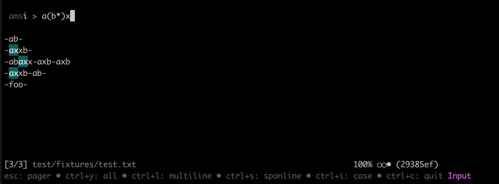
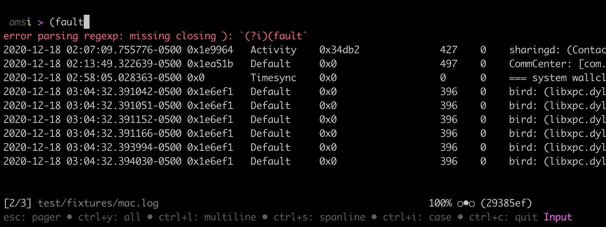
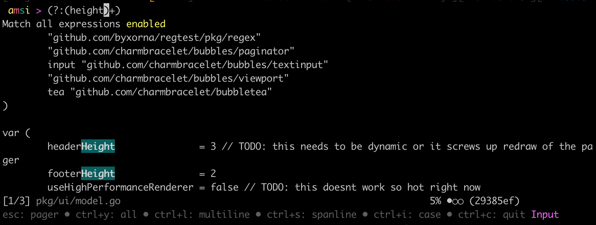

# Regtest

Interactively validate regex against test data in your console







# Dev

```
$ make dev # opens a fixture
```

# About

I use [rubular.com](rubular.com) constantly, and wanted to make something similar that I could keep closer at hand in the console.

# TODO

- [ ] implement different color for submatches vs matches
- [ ] implement a submatch expression explorer to visualise submatches as a tree

